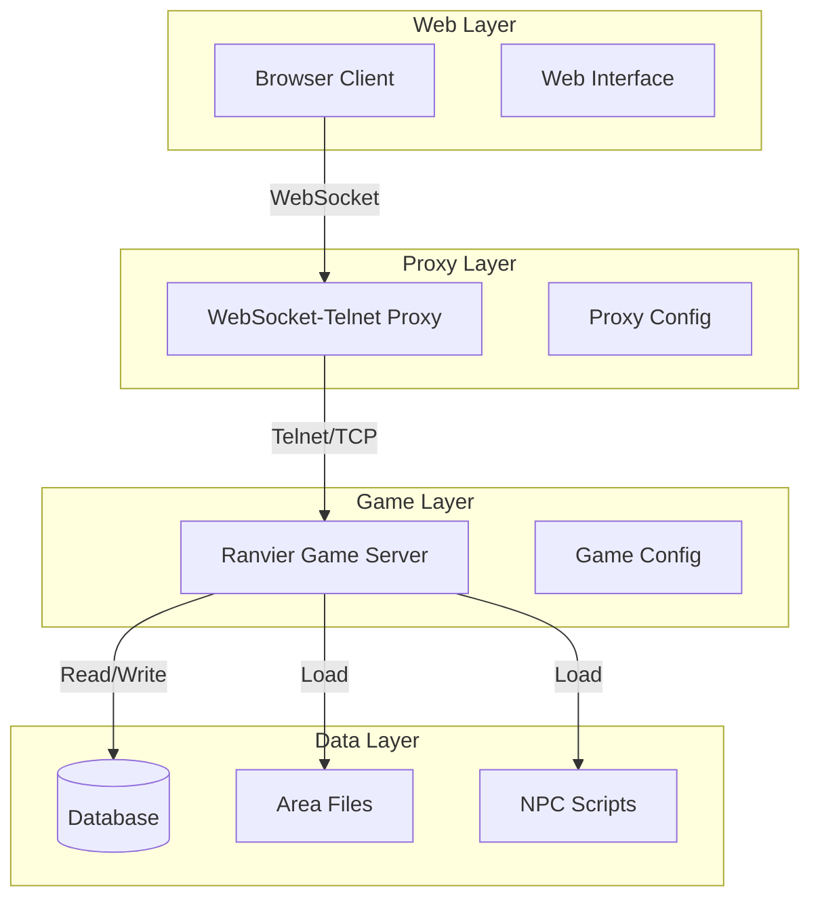

# Design Document

## Overview

The Ranvier MUD Browser Client system consists of three main components: a Ranvier game server running on Node.js, a WebSocket-to-Telnet proxy service, and a browser-based client interface. This architecture allows players to connect to a traditional MUD server through modern web browsers while maintaining compatibility with existing Ranvier functionality.

The system uses a proxy pattern to bridge the gap between WebSocket connections (browser-friendly) and Telnet connections (MUD server standard). This approach minimizes changes to the core Ranvier engine while enabling web-based gameplay.

## Architecture

### High-Level Architecture



### Component Responsibilities

**Browser Client**
- Renders terminal-like interface using xterm.js
- Handles user input and sends commands via WebSocket
- Processes ANSI color codes and formatting
- Manages connection state and reconnection logic

**WebSocket-Telnet Proxy**
- Accepts WebSocket connections from browsers
- Establishes TCP connections to Ranvier telnet server
- Bidirectional message forwarding between protocols
- Handles connection lifecycle and error management
- Processes Telnet IAC (Interpret As Command) sequences

**Ranvier Game Server**
- Core MUD engine handling game logic
- Player character creation, authentication, and persistence
- World simulation (rooms, NPCs, items, combat)
- Command processing and game state management
- Database operations for character and world data
- Combat system with turn-based mechanics
- NPC behavior management and dialogue systems

## Components and Interfaces

### WebSocket-Telnet Proxy

**Interface Definition:**
```javascript
// WebSocket Server Interface
interface ProxyServer {
  port: number;
  onConnection(callback: (ws: WebSocket) => void): void;
  close(): void;
}

// Telnet Connection Interface
interface TelnetConnection {
  host: string;
  port: number;
  connect(): Promise<void>;
  write(data: Buffer): void;
  onData(callback: (data: Buffer) => void): void;
  close(): void;
}
```

**Key Features:**
- Raw byte forwarding between WebSocket and Telnet
- Binary data handling for ANSI sequences
- Connection pooling and cleanup
- Error handling and logging
- Configurable timeouts and reconnection

### Browser Client Interface

**Core Components:**
```javascript
// Terminal Interface
interface TerminalClient {
  container: HTMLElement;
  terminal: Terminal; // xterm.js instance
  websocket: WebSocket;
  connect(url: string): Promise<void>;
  send(command: string): void;
  onReceive(callback: (data: string) => void): void;
}

// Connection Manager
interface ConnectionManager {
  url: string;
  reconnectAttempts: number;
  connect(): Promise<void>;
  disconnect(): void;
  isConnected(): boolean;
}
```

### Ranvier Game Server Configuration

**World Structure:**
- Areas: 6-12 interconnected rooms forming a small dungeon
- Items: Basic weapons, consumables, and interactive objects with take/drop mechanics
- NPCs: 1-2 characters with simple AI behaviors, dialogue trees, and combat capabilities
- Combat: Turn-based system with health, damage, death handling, and respawn mechanics

**Character Management:**
- New player onboarding with character creation flow
- Persistent character state across sessions
- Account validation and character name uniqueness
- Automatic character restoration on reconnection

**Persistence Layer:**
- Database: NeDB for development, configurable for production
- Character data: Stats, inventory, location, progress, creation timestamp
- World state: Item locations, NPC states, dynamic content
- Session management: Login tracking, connection state

## Data Models

### Player Character Model
```javascript
interface PlayerCharacter {
  id: string;
  name: string;
  stats: {
    health: number;
    maxHealth: number;
    level: number;
    experience: number;
  };
  location: {
    areaId: string;
    roomId: string;
  };
  inventory: Item[];
  equipment: Equipment;
  combatState: CombatState;
  isNewCharacter: boolean;
  createdAt: Date;
  lastLogin: Date;
}

interface Equipment {
  weapon?: Item;
  armor?: Item;
  accessories: Item[];
}
```

### Game World Models
```javascript
interface Room {
  id: string;
  areaId: string;
  title: string;
  description: string;
  exits: { [direction: string]: string };
  items: Item[];
  npcs: NPC[];
  players: PlayerCharacter[];
}

interface Item {
  id: string;
  name: string;
  description: string;
  type: 'weapon' | 'consumable' | 'misc';
  properties: { [key: string]: any };
  location: {
    type: 'room' | 'inventory';
    containerId: string;
  };
}

interface NPC {
  id: string;
  name: string;
  description: string;
  stats: CharacterStats;
  behaviors: Behavior[];
  dialogue: DialogueTree;
  isHostile: boolean;
  combatState: CombatState;
}

interface CombatState {
  inCombat: boolean;
  target?: string;
  initiative: number;
  lastAction: Date;
}
```

### WebSocket Message Protocol
```javascript
interface WebSocketMessage {
  type: 'data' | 'command' | 'system';
  payload: string | Buffer;
  timestamp: number;
}

interface SystemMessage {
  type: 'system';
  subtype: 'connected' | 'disconnected' | 'error';
  message: string;
}
```

## Error Handling

### Connection Management
- **WebSocket Disconnection**: Automatic reconnection with exponential backoff
- **Telnet Server Unavailable**: Display maintenance message, retry connection
- **Proxy Failure**: Graceful degradation, error logging, service restart
- **Data Corruption**: Validate message integrity, discard malformed packets

### Game State Errors
- **Character Load Failure**: Fallback to character creation flow
- **New Character Detection**: Prompt for character creation on first connection
- **Database Unavailable**: Cache operations, sync when available
- **Invalid Commands**: User-friendly error messages, command suggestions
- **Movement Errors**: Clear feedback for invalid directions or blocked exits
- **Inventory Errors**: Handle full inventory, invalid items, take/drop failures
- **Combat Edge Cases**: Prevent infinite loops, handle death states, manage NPC hostility
- **NPC Interaction Errors**: Handle missing dialogue, invalid interactions

### Error Recovery Strategies
```javascript
interface ErrorHandler {
  handleConnectionError(error: Error): void;
  handleGameError(error: GameError): void;
  handleDataError(error: DataError): void;
  logError(error: Error, context: string): void;
}
```

## Testing Strategy

### Unit Testing
- **Proxy Logic**: Message forwarding, protocol conversion, connection handling
- **Game Mechanics**: Combat calculations, inventory operations, movement validation
- **Character Management**: Creation flow, validation, persistence, authentication
- **Command Processing**: Movement commands, inventory commands, combat commands, NPC interactions
- **Data Models**: Character creation, persistence operations, validation rules
- **Utility Functions**: ANSI parsing, command parsing, data transformation

### Integration Testing
- **End-to-End Flows**: Character creation through browser to database persistence
- **Protocol Testing**: WebSocket-Telnet message integrity across proxy
- **Game Session Testing**: Complete gameplay scenarios from login to logout
- **Movement and Navigation**: Room transitions, exit validation, player location tracking
- **Inventory Management**: Take/drop operations, inventory persistence, item interactions
- **Combat System**: Attack sequences, damage calculation, death and respawn handling
- **NPC Interactions**: Dialogue systems, hostile behavior, combat initiation
- **Database Integration**: CRUD operations, transaction handling, data consistency

### Browser Testing
- **Cross-Browser Compatibility**: Chrome, Firefox, Safari, Edge
- **Terminal Rendering**: ANSI color codes, text formatting, scrolling
- **Input Handling**: Keyboard events, special keys, command history
- **Connection Resilience**: Network interruption, server restart scenarios

### Performance Testing
- **Concurrent Connections**: Multiple players, proxy throughput
- **Memory Usage**: Long-running sessions, connection cleanup
- **Latency Testing**: Command response times, real-time interaction
- **Load Testing**: Server capacity, database performance under load

### Automated Testing Framework

**Test Coverage Requirements:**
- **Core Game Mechanics**: 90%+ coverage for combat, inventory, movement systems
- **WebSocket Proxy**: 100% coverage for protocol conversion and message forwarding
- **Player Actions**: Comprehensive validation of all user commands and expected outcomes
- **Integration Flows**: End-to-end testing from browser input to database persistence

**Testing Infrastructure:**
```javascript
// Test Categories and Tools
const testingStrategy = {
  unit: {
    framework: 'Jest',
    coverage: ['game-mechanics', 'proxy-logic', 'data-models'],
    mocking: 'Database and network operations'
  },
  integration: {
    framework: 'Jest + Supertest',
    coverage: ['websocket-telnet-proxy', 'database-operations'],
    environment: 'Containerized test environment'
  },
  e2e: {
    framework: 'Playwright',
    coverage: ['browser-client', 'full-gameplay-flows'],
    browsers: ['Chrome', 'Firefox', 'Safari']
  },
  performance: {
    framework: 'Artillery.js',
    coverage: ['concurrent-users', 'message-throughput'],
    metrics: ['response-time', 'memory-usage', 'connection-stability']
  }
};
```

**Continuous Integration:**
- Automated test execution on code changes
- Test result reporting and failure notifications
- Performance regression detection
- Cross-browser compatibility validation

## Deployment Architecture

### Development Environment
```yaml
# docker-compose.dev.yml
services:
  ranvier:
    build: ./ranvier
    ports:
      - "3000:3000"
    volumes:
      - ./game-data:/app/data
    environment:
      - NODE_ENV=development
      
  proxy:
    build: ./proxy
    ports:
      - "8080:8080"
    depends_on:
      - ranvier
    environment:
      - TELNET_HOST=ranvier
      - TELNET_PORT=3000
      
  web:
    build: ./web-client
    ports:
      - "3001:80"
    depends_on:
      - proxy
```

### Production Deployment
- **Container Orchestration**: Docker Compose or Kubernetes
- **Reverse Proxy**: Nginx for SSL termination and load balancing
- **Database**: Persistent volume for character data
- **Monitoring**: Health checks, log aggregation, metrics collection
- **Backup Strategy**: Automated database backups, configuration versioning

### Security Considerations
- **WebSocket Security**: WSS (TLS) for encrypted connections
- **Input Validation**: Sanitize all user input before processing
- **Rate Limiting**: Prevent command flooding and abuse
- **Authentication**: Secure character creation and login flows
- **Data Protection**: Encrypt sensitive character information
- **Container Security**: Secure Docker configurations, non-root users, minimal attack surface

### Containerization Strategy

**Development Environment:**
- Docker Compose configuration for local development
- Volume mounts for live code reloading
- Separate containers for each service (Ranvier, Proxy, Web Client)
- Shared network for inter-service communication
- Environment-specific configuration management

**Production Deployment:**
- Multi-stage Docker builds for optimized images
- Health checks for all services
- Persistent volumes for database and game data
- Container orchestration ready (Docker Swarm/Kubernetes)
- Automated service discovery and configuration
- Log aggregation and monitoring integration

**Service Configuration:**
```yaml
# Key deployment considerations
services:
  ranvier:
    healthcheck: TCP connection test on port 3000
    volumes: Persistent game data and character database
    environment: Production database configuration
  
  proxy:
    healthcheck: WebSocket connection test
    depends_on: Ranvier service availability
    environment: Telnet host and port configuration
  
  web-client:
    healthcheck: HTTP endpoint availability
    depends_on: Proxy service availability
    environment: WebSocket proxy URL configuration
```

## Performance Optimization

### Proxy Optimization
- **Connection Pooling**: Reuse Telnet connections where possible
- **Buffer Management**: Efficient memory usage for message forwarding
- **Compression**: Optional WebSocket compression for large messages
- **Caching**: Cache frequently accessed game data

### Game Server Optimization
- **Database Indexing**: Optimize character and world data queries
- **Memory Management**: Efficient object lifecycle in Node.js
- **Event Loop**: Non-blocking operations for concurrent players
- **Asset Loading**: Lazy loading of areas and content

### Client Optimization
- **Terminal Rendering**: Efficient DOM updates, virtual scrolling
- **Message Batching**: Reduce WebSocket message frequency
- **Local Caching**: Cache static content, reduce server requests
- **Progressive Loading**: Load UI components as needed